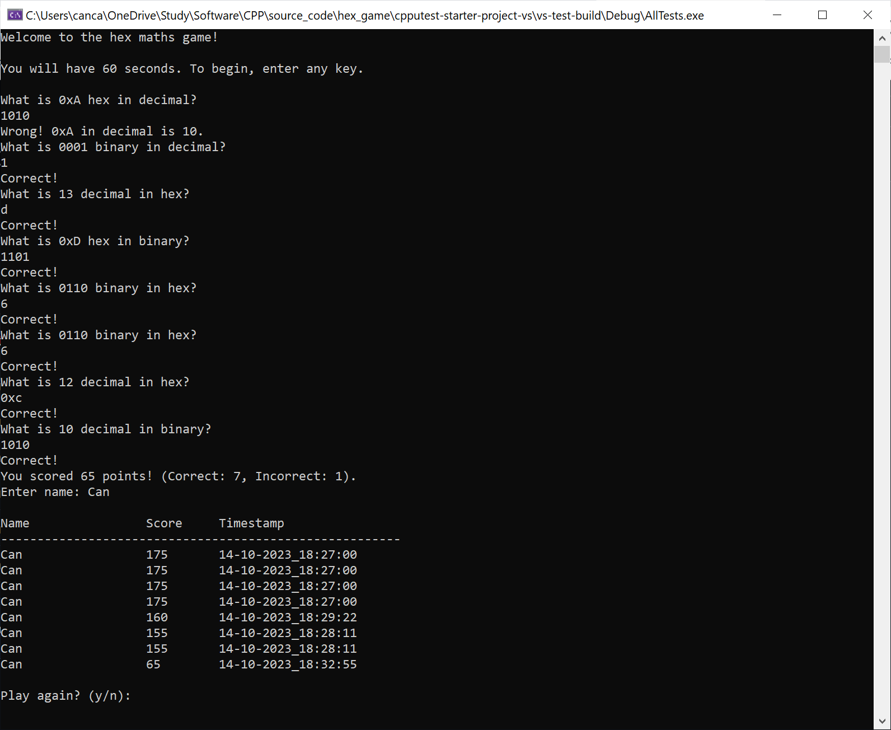
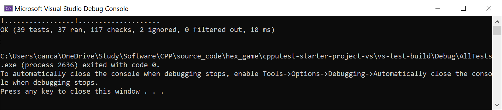

# Nibble Conversion Trainer Game
## Description

This is a game designed to help train your ability to convert between hexadecimal, binary, and decimal nibbles. Developed following Test-Driven Development (TDD) principles, this game offers an engaging and educational experience.

## Features

Convert between hex, binary, and decimal nibbles

## Tech Stack
- Language: C++
- Test Framework: CppUTest
- Environment: Visual Studio

The project was developed using TDD principles. Below is a screenshot of the tests passing.

## Acknowledgments
Built on top of James Grenning's Visual Studio Starter Project. Link [here](https://github.com/jwgrenning/cpputest-starter-project-vs/tree/master).

